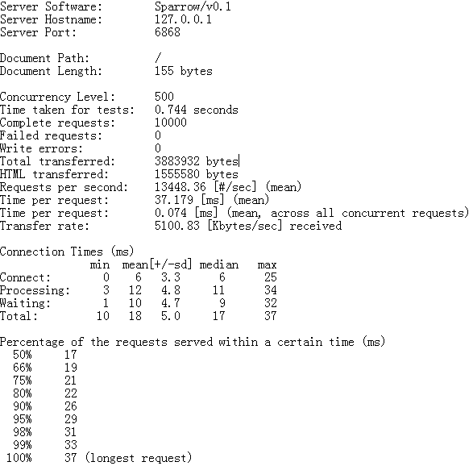
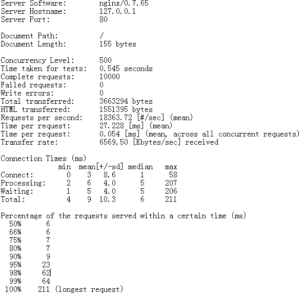
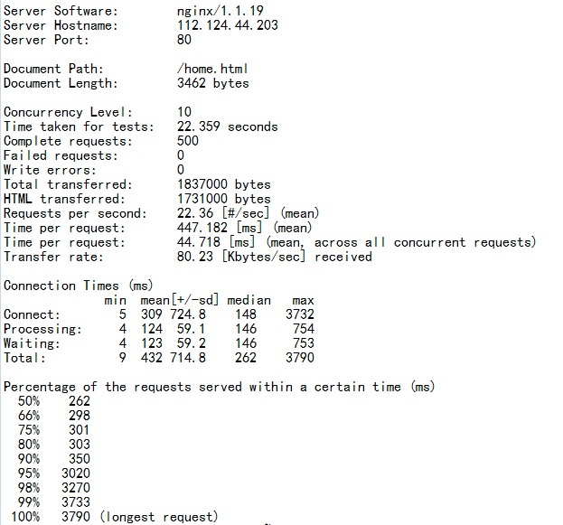

#Sparrow

`sparrow` 是一个简单高效的http server，纯C语言开发，目前主要用在本人个人的网站.

----------------
###How To Use
   * make
   * 在config/sparrow.conf中配置server。[可选]
   * ./sparrow
   * open in browser http://127.0.0.1:6868/ [默认端口6868]
   * http://127.0.0.1:6868/myfolder To Test Folder
   
----------------
###功能
   * 支持目录的访问(自定义格式)
   * 支持多线程（可配置工作线程数目）
   * 支持sendfile, tcp_cock等高效操作
   * 支持404， 500
   * 支持304 not modified
   * 支持异步的日志：
       * 支持零点自动切换日志文件
       * 完善清晰的格式
       * 多线程支持
   * 支持epoll
   * 不依赖任何第三方库

-----------------
###待续...
   * __bug:当目录下文件过大时，buf溢出问题__
   *  均衡工作线程的地方，现在用的是随机分配，增加统计每个线程中的任务数，然后分配
   * how to reduce time\_wait in server side? May be it will work that [close() when finishing a request in server side -->   register EV\_READ. send connection close in http header, thus client closing the conn actively!]
   * chunked 编码支持
   * __bug:在网速基本为0的情况下，连接远端服务器，结果把log输入到了网页，未重现__
   * 添加一个检测程序，当程序死掉或者不能访问的时候， 重启进程。（确保存活，并确保线程没有崩）
   

----------------
###笔记
   * 2014-9-16: fix bug of image corrupt and segment err (http_code not init)
   * 2014-9-17: 解决大量请求的时候服务器崩溃。原因：clear()操作放到了close(fd)之后，在多线程的环境下，当线程1执行完了close(fd),此时在clear之前被线程2打断，线程2重用了上面的fd，并执行后续操作，但是当线程1恢复过来继续执行clear()操作,却把fd重置了，那么线程2在执行fd相关操作的时候就会出现Segmentation Fault.(PS: 多线成环境下找到SEG ERR 发生的点还真是不容易，分析了core文件，勉强出现的信息还能看，但是不具体，为什么？).
   * 2014-10-1:增加一个日志开关，可以选择
   * 2014-10-2: bug:解决多线程环境下，高并发的时候会出现 epoll_ctl add 出错，报错File  exist。
   error in multithreaded program "epollControl: does not exist (No such file or directory)"单线程不会出错，肯定是多线程的时候某个地方没考虑到. __epoll_ctl man page tells me that the reason for this error is:"ENOENT: op was EPOLL_CTL_MOD or EPOLL_CTL_DEL, and fd is not in epfd."__
   _错误是连接退出是active应该没有被重置_
   * 2014-10-3:增加了配置文件，并重构了代码，tag v0.09
   * 2014-10-10:解决,当连接超过max_event时会发生数组溢出而崩溃，所以需要限制连接，设置一个最大值
   * 2014-10-14:解决,url中包含中文而不能匹配文件名的问题。
   * 2014-10-15:fix bug:__目录下输出的子目录和文件排序问题__
   * 2014-10-17:fix bug:目录名中含有小数点'.'访问出错
   * 2014-10-19:增加个人website前端模板

##性能测试(offline/online)(_sparrow VS nginx_)
_note: 这并不是一个公平的性能对比，由于本人对nginx并不是那么的熟，nginx基本上就是用的默认的配置，而且nginx的版本也不是很新。以下对比仅仅是一个粗略的参考_

`cpu: Intel(R) Core(TM) i3-2100 CPU @ 3.10GHz , 4 cores; mem: 1G`

-----------------
##Offline
####ab 测试
`ab -n 10000 -c 500 http://127.0.0.1:xxxx/`

__sparrow__

__nginx__

------------------
####webbench 测试
`webbench -c 500 -t 60 http://127.0.0.1:xxxx/`

__sparrow__

__nginx__

-----------------
##Online
`阿里云，1核cpu，1G内存，1M带宽，Ubuntu12.04`

`ab -n 500 -c 10 http://xxx.xxx.xxx.xxx:xxxx/`

__sparrow__

__nginx__

`webbech -c 500 -t 60 http://xxxx`

`sparrow, nginx respectively`

